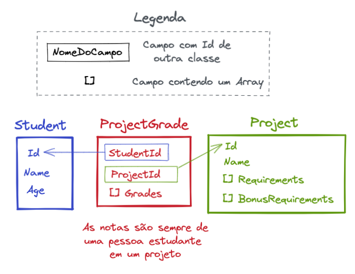

# Boas-vindas ao repositório do exercício Consultas Escolares

Para realizar o projeto, atente-se a cada passo descrito a seguir, e se tiver qualquer dúvida, nos envie por _Slack_! #vqv 🚀

Aqui você vai encontrar os detalhes de como estruturar o desenvolvimento do seu projeto a partir deste repositório, utilizando uma branch específica e um _Pull Request_ para colocar seus códigos.

# Termos e acordos

Ao iniciar este projeto, você concorda com as diretrizes do Código de Conduta e do Manual da Pessoa Estudante da Trybe.

# Orientações

<details>
  <summary><strong>‼️ Antes de começar a desenvolver</strong></summary><br />

  1. Clone o repositório

  - Use o comando: `git clone git@github.com:tryber/acc-csharp-0x-exercise-school-queries.git`.
  - Entre na pasta do repositório que você acabou de clonar:
    - `cd acc-csharp-0x-exercise-school-queries`

  2. Instale as dependências

  - Entre na pasta `src/`.
  - Execute o comando: `dotnet restore`.
  
  1. Crie uma branch a partir da branch `master`

  - Verifique que você está na branch `master`
    - Exemplo: `git branch`
  - Se não estiver, mude para a branch `master`
    - Exemplo: `git checkout master`
  - Agora crie uma branch à qual você vai submeter os `commits` do seu projeto
    - Você deve criar uma branch no seguinte formato: `nome-de-usuario-nome-do-projeto`
    - Exemplo: `git checkout -b joaozinho-acc-csharp-0x-exercise-school-queries`

  4. Adicione as mudanças ao _stage_ do Git e faça um `commit`

  - Verifique que as mudanças ainda não estão no _stage_
    - Exemplo: `git status` (deve aparecer listada a pasta _joaozinho_ em vermelho)
  - Adicione o novo arquivo ao _stage_ do Git
    - Exemplo:
      - `git add .` (adicionando todas as mudanças - _que estavam em vermelho_ - ao stage do Git)
      - `git status` (deve aparecer listado o arquivo _joaozinho/README.md_ em verde)
  - Faça o `commit` inicial
    - Exemplo:
      - `git commit -m 'iniciando o projeto x'` (fazendo o primeiro commit)
      - `git status` (deve aparecer uma mensagem tipo _nothing to commit_ )

  5. Adicione a sua branch com o novo `commit` ao repositório remoto

  - Usando o exemplo anterior: `git push -u origin joaozinho-acc-csharp-0x-exercise-school-queries`

  6. Crie um novo `Pull Request` _(PR)_

  - Vá até a página de _Pull Requests_ do [repositório no GitHub](https://github.com/tryber/acc-csharp-0x-exercise-school-queries/pulls)
  - Clique no botão verde _"New pull request"_
  - Clique na caixa de seleção _"Compare"_ e escolha a sua branch **com atenção**
  - Coloque um título para a sua _Pull Request_
    - Exemplo: _"Cria tela de busca"_
  - Clique no botão verde _"Create pull request"_
  - Adicione uma descrição para o _Pull Request_ e clique no botão verde _"Create pull request"_
  - **Não se preocupe em preencher mais nada por enquanto!**
  - Volte até a [página de _Pull Requests_ do repositório](https://github.com/tryber/acc-csharp-0x-exercise-school-queries/pulls) e confira que o seu _Pull Request_ está criado

</details>

<details>
  <summary><strong>⌨️ Durante o desenvolvimento</strong></summary><br/>

  - Faça `commits` das alterações que você fizer no código regularmente

  - Lembre-se de sempre após um (ou alguns) `commits` atualizar o repositório remoto

  - Os comandos que você utilizará com mais frequência são:
    1. `git status` _(para verificar o que está em vermelho - fora do stage - e o que está em verde - no stage)_
    2. `git add` _(para adicionar arquivos ao stage do Git)_
    3. `git commit` _(para criar um commit com os arquivos que estão no stage do Git)_
    4. `git push -u origin nome-da-branch` _(para enviar o commit para o repositório remoto na primeira vez que fizer o `push` de uma nova branch)_
    5. `git push` _(para enviar o commit para o repositório remoto após o passo anterior)_

</details>

<details>
  <summary><strong>🤝 Depois de terminar o desenvolvimento (opcional)</strong></summary><br/>

  Para sinalizar que o seu projeto está pronto para o _"Code Review"_, faça o seguinte:

  - Vá até a página **DO SEU** _Pull Request_, adicione a label de _"code-review"_ e marque seus colegas:

    - No menu à direita, clique no _link_ **"Labels"** e escolha a _label_ **code-review**;

    - No menu à direita, clique no _link_ **"Assignees"** e escolha **o seu usuário**;

    - No menu à direita, clique no _link_ **"Reviewers"** e digite `students`, selecione o time `tryber/students-sd-0x`.

  Caso tenha alguma dúvida, [aqui tem um video explicativo](https://vimeo.com/362189205).

</details>

<details>
  <summary><strong>🕵🏿 Revisando um pull request</strong></summary><br />

  Use o conteúdo sobre [Code Review](https://app.betrybe.com/course/real-life-engineer/code-review) para te ajudar a revisar os _Pull Requests_.

</details>

<details>
  <summary><strong>🎛 Linter</strong></summary><br />

  Usaremos o [NetAnalyzer](https://docs.microsoft.com/pt-br/dotnet/fundamentals/code-analysis/overview) para fazer a análise estática do seu código.

  Este projeto já vem com as dependências relacionadas ao _linter_ configuradas no arquivo `.csproj`.

  O analisador já é instalado pelo plugin da `Microsoft C#` no `VSCode`. Para isso, basta fazer o download do [plugin](https://marketplace.visualstudio.com/items?itemName=ms-dotnettools.csharp) e instalá-lo.
</details>

<details>
  <summary><strong>🛠 Testes</strong></summary><br />

  O .NET já possui sua própria plataforma de testes.
  
  Este projeto já vem configurado e com suas dependências

  ### Executando todos os testes

  Para executar os testes com o .NET execute o comando dentro do diretório do seu projeto `src/SchoolQueries` ou de seus testes `src/SchoolQueries.Test`!

  ```
  dotnet test
  ```

  ### Executando um teste específico

  Para executar um teste expecífico basta executar o comando `dotnet test --filter Name~TestMethod1`.

  :warning: **Importante:** o comando irá executar testes cujo nome contém `TestMethod1`.

  :warning: **O avaliador automático não necessariamente avalia seu projeto na ordem em que os requisitos aparecem no readme. Isso acontece para deixar o processo de avaliação mais rápido. Então, não se assuste se isso acontecer, ok?**

  ### Outras opções para testes
  - Algumas opções que podem lhe ajudar são:
    -  `-?|-h|--help`: exibem a descrição completa de como utilizar o comando.
    -  `-t|--list-tests`: lista todos os testes ao invés de executá-los.
    -  `-v|--verbosity <LEVEL>`: define o nível de detalhe na resposta dos testes.
      - `q | quiet`
      - `m | minimal`
      - `n | normal`
      - `d | detailed`
      - `diag | diagnostic`
      - Exemplo de uso: 
         ```
           dotnet test -v diag
         ```
         ou
         ```            
           dotnet test --verbosity=diagnostic
         ``` 
</details>

<details>
  <summary><strong>🗣 Nos dê feedbacks sobre o projeto!</strong></summary><br />

Ao finalizar e submeter o projeto, não se esqueça de avaliar sua experiência preenchendo o formulário. 
**Leva menos de 3 minutos!**

[FORMULÁRIO DE AVALIAÇÃO DE PROJETO](https://be-trybe.typeform.com/to/PsefzL2e)

</details>

<details>
  <summary><strong>🗂 Compartilhe seu portfólio!</strong></summary><br />

  Você sabia que o LinkedIn é a principal rede social profissional e compartilhar o seu aprendizado lá é muito importante para quem deseja construir uma carreira de sucesso? Compartilhe esse projeto no seu LinkedIn, marque o perfil da Trybe (@trybe) e mostre para a sua rede toda a sua evolução.

</details>

# Requisitos

Você foi contratado pela Trybe para desenvolver consultas ao banco de dados de notas de pessoas estudantes em projetos.

Para isso, você vai construir o projeto School Queries. Neste projeto você vai criar consultas LINQ que utilizam os conceitos e funções aprendidas até agora.

Neste projeto você terá de completar as funções ainda não implementadas na classe `SchoolDatabase`. Essa classe possui 3 propriedades que são _Arrays_ para armazenar os dados de estudantes, projetos e notas em projetos, e cada um destes é uma classe e elas possuem uma relação feita a partir de id's, seguindo a seguinte estrutura:



Para criar as consultas você precisa ter em mente as relações entre as classes, e utilizar o campos `Id` de `Student` e `Project` para criar uma relação com `ProjectGrade`. Como na classe `Database` haverá um _Array_ de cada uma destas classes utilize os métodos de consultas LINQ que permitem a consulta em múltiplas fontes de dados simultâneamente para facilitar as suas consultas.

De olho na dica👀: Para transformar uma resposta de uma consulta LINQ em um _Array_ é possível utilizar o método `.ToArray()` da seguinte forma:

```csharp
var studentsQuery = 
    from student in students
    where student.Name[0] == 'a'
    select student;

// Apoós fazer a consulta, utilizar ToArray irá transformar a resposta em um Array do mesmo tipo selecionado pelo select
Student[] studentsStaringWithA = studentsQuery.ToArray();
```

> **🚨Importante🚨**: Para realizar os testes você irá precisar utilizar `MemberData` e não `InlineData` pois os dados de entrada serão _Arrays_ de instâncias de classes tornando impossível a utilização do `InlineData`.

> Para que o avaliador consiga testar seus testes corretamente iremos utilizar como entrada para cada função de teste uma instância da classe `SchoolDatabase` com dados pré-populados. Sendo assim, utilize os parâmetros das funções de teste e a instância de `SchoolDatabase` recebida por parâmetro para testar os requisitos do seu projeto. Vamos ver com um exemplo como fica isso na prática:

```csharp
[Theory(DisplayName = "Test GetStudentsByName")]
[MemberData(nameof(DataTestGetStudentsByName))]
public void TestGetStudentsByName(SchoolDatabase databaseEntry, string nameEntry, Student[] studentsExpected)
{
    var result = databaseEntry.GetStudentsByName(nameEntry);
    result.Should().BeEquivalentTo(studentsExpected);
}
```

Repare que neste teste é utilizado a instância de `SchoolDatabase` recebida como parâmetro para testar o método `GetStudentsByName`, então para isso uma instância dessa classe precisa estar na propriedade utilizada como `MemberData`, ficando assim:

```csharp
public static TheoryData<SchoolDatabase, string, Student[]> DataTestGetStudentsByName => 
    new(){
        {
            GetSchoolDatabaseInstanceToTest(),
            "Student 1",
            new Student[]{
                new Student() {
                    Id = 1,
                    Name = "Student 1",
                    Age = 20,
                },
            }
        },
        {
            GetSchoolDatabaseInstanceToTest(),
            "Student 3",
            new Student[]{
                new Student() {
                    Id = 3,
                    Name = "Student 3",
                    Age = 22,
                }
            }
        }
    };
```

E finalmente para que o `MemberData` funcione corretamente, é utilizado o método `GetSchoolDatabaseInstanceToTest` que retorna uma instância de `SchoolDatabase`. Com este método não precisamos criar várias instâncias dessa classe para cada novo caso de teste.

Sinta-se livre para utilizar este método que já esta implementado na classe `TestSchoolDatabase` e possui alguns dados de exemplo ou se preferir pode criar sua própria instância de `SchoolDatabase` para cada teste.

Você pode modificar os dados de exemplo em `GetSchoolDatabaseInstanceToTest` se preferir.

## 1 - Buscar pessoas estudantes por nome
_Implemente o método `GetStudentsByName` na classe `SchoolDatabase`_

<details>
  <summary>O método deve receber um nome e retornar um array de estudantes que contenham o nome passado por parâmetro</summary><br />

  A classe `SchoolDatabase` deve conter uma implementação para o método `GetStudentsByName`, crie o método utilizando uma consulta LINQ no atributo `Students` de forma a retornar um _Array_.

  Os testes dessa função já foram implementados no arquivo `src/SchoolQueries.Test/TestSchoolDatabase.cs` na função `TestGetStudentsByName`. Utilize este teste como base para realizar os testes dos outros requisitos.
</details>

## 2 - Buscar pessoas estudantes com média acima
_Implemente o método `GetStudentsWithAverageGradeInProjectAbove` na classe `SchoolDatabase`_

<details>
  <summary>Este método deve retornar um Array com todas as pessoas estudantes que possuem média de notas em projetos acima de um valor especificado</summary><br />

  Crie uma consulta LINQ que busque todas as pessoas estudantes pela média de notas em um projeto e retorne todas aquelas que possuem essa média acima do valor passado por parâmetro.
</details>

<details>
  <summary>Crie os testes para a função <code>GetStudentsWithAverageGradeInProjectAbove</code></summary><br />

  Implemente seu teste no arquivo `src/SchoolQueries.Test/TestSchoolDatabase.cs` na função `TestGetStudentsWithAverageGradeInProjectAbove`.

  Este teste precisa ser capaz de identificar se a resposta da função é correta dada as entradas. 
  
  De olho na dica👀: Modifique a propriedade `DataTestGetStudentsWithAverageGradeInProjectAbove` que está no `MemberData` do teste e adicione os casos que deseja testar, é importante que os tipos sejam os mesmos presentes no parâmetro do método do teste. Lembre-se de utilizar o banco de dados e os outros valores recebidos como parâmetro para desenvolver o seu teste.
</details>

## 3 - Buscar projetos com notas baixas
_Implemente o método `GetProjectsWithMinimumGradeInProjectBelow` na classe `SchoolDatabase`_

<details>
  <summary>Este método deve retornar um Array com todos os projetos que possuem alguma nota abaixo do valor passado por parâmetro</summary><br />

  Dado uma nota inteira como parâmentro, retorne um _Array_ com todos os projetos que possuem alguma nota com valor abaixo do passado por parâmetro, utilize uma consulta LINQ com os métodos aprendidos durante a lição.
</details>

<details>
  <summary>Crie os testes para a função <code>GetProjectsWithMinimumGradeInProjectBelow</code></summary><br />

  Implemente seu teste no arquivo `src/SchoolQueries.Test/TestSchoolDatabase.cs` na função `TestGetProjectsWithMinimumGradeInProjectBelow`.

  Este teste precisa ser capaz de identificar se a resposta da função é correta dada as entradas.
  
    De olho na dica👀: Modifique a propriedade `DataTestGetProjectsWithMinimumGradeInProjectBelow` que está no `MemberData` do teste e adicione os casos que deseja testar, é importante que os tipos sejam os mesmos presentes no parâmetro do método do teste. Lembre-se de utilizar o banco de dados e os outros valores recebidos como parâmetro para desenvolver o seu teste.
</details>

## 4 - Buscar estudantes que realizaram o projeto
_Implemente o método `GetStudentsDoneProject` na classe `SchoolDatabase`_

<details>
  <summary>Este método deve retornar um Array com todas as pessoas estudantes que realizaram o projeto com o nome passado por parâmetro</summary><br />

  Dado um nome de projeto, retorne um _Array_ de `Student` com todas as pessoas estudantes que realizaram um projeto com aquele nome. Utilize uma consulta LINQ para implementar este método. 
  
  De olho na dica👀: Para realizar este requisito será necessário combinar todas as fontes de dados (_Arrays_ de estudantes, projetos e notas) em uma única consulta, já que é em `ProjectGrade` que existe a relação entre uma pessoa estudante e um projeto. Tenha isso em mente na hora de criar a sua consulta.
</details>

<details>
  <summary>Crie os testes para a função <code>GetStudentsDoneProject</code></summary><br />

  Implemente seu teste no arquivo `src/SchoolQueries.Test/TestSchoolDatabase.cs` na função `TestGetStudentsDoneProject`.

  Este teste precisa ser capaz de identificar se a resposta da função é correta dada as entradas.

  De olho na dica👀: Modifique a propriedade `DataTestGetStudentsDoneProject` que está no `MemberData` do teste e adicione os casos que deseja testar, é importante que os tipos sejam os mesmos presentes no parâmetro do método do teste. Lembre-se de utilizar o banco de dados e os outros valores recebidos como parâmetro para desenvolver o seu teste.
</details>
